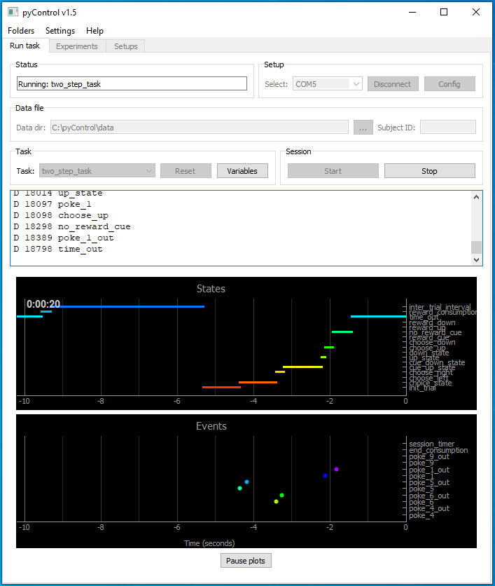
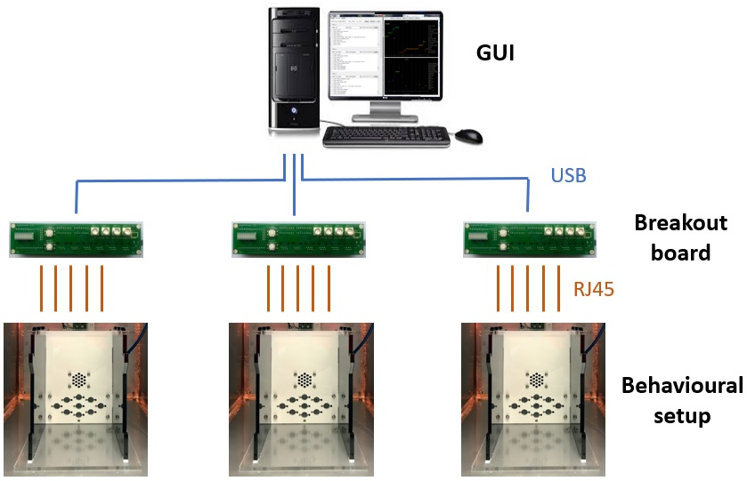

# pyControl

**Open source, Python based, behavioural experiment control.**



## Overview

pyControl is a system of open source hardware and software for controlling behavioural experiments, built around the [Micropython](https://micropython.org/) microcontroller.

pyControl makes it easy to program complex behavioural tasks using a clean, intuitive, and flexible syntax for specifying tasks as state machines. User created task definition files, written in Python, run directly on the microcontroller, supported by pyControl framework code.  This gives users the power and simplicity of Python for specifying task behaviour, while allowing advanced users low-level access to the microcontroller hardware.  For more information see [programming tasks](user-guide/programming-tasks.md).



pyControl [hardware](user-guide/hardware.md) consists of a breakout board and a set of devices such as nose-pokes, audio boards, LED drivers, rotary encoders and stepper motor controllers that are connected to the breakout board to create behavioural setups.  Assembled pyControl hardware is available from the [OpenEphys store](http://www.open-ephys.org/pycontrol).

pyControl has a [Graphical User Interface](user-guide/graphical-user-interface.md) for controlling experiments and visualing behaviour.

Tools for importing pyControl data into Python for analysis are provided in the [data_import](user-guide/pycontrol-data.md) module.

The pyControl [google group](https://groups.google.com/forum/#!forum/pycontrol) is a email list for pyControl users.

---

## Getting started


### Installation

Download the latest version of pyControl as a zip file from the github [repository](https://github.com/pyControl/pyControl)). Unzip the folder on your computer and you will have the following folder structure:

```
- pyControl
	- gui          # Graphical user interface
    - cli          # Command line interface
    - com          # Serial communication and data logging
    - config       # Configuration files edited by user
    - data         # Behavioural data.
    - experiments  # Experiment definition files.
    - devices      # pyControl hardware classes (uploaded to pyboard).
    - pyControl    # pyControl framework        (uploaded to pyboard).
    - tasks        # Task definition files
    - tools        # Tools for importing and visualising pycontrol data
```

### Dependencies

pyControl has the following dependencies:

- Python 3  -  3.7.5 recomended as pyqtgraph is not currently compatible with 3.8.
- pyserial
- numpy
- pyqt5
- pyqtgraph

 On a windows machine that does not already have Python installed, the simplest way to install Python is to download an installer from [python.org](https://www.python.org/downloads/). To ensure you can run Python files (including the pyControl GUI) by double clicking on them, select the options 'Add Python to PATH', 'Add Python to environment variables', and 'Associate files with Python' during installation.  Note; selecting these options when installing Python will cause the Python version you are installing to take precedence over any other version of Python installed on the computer, so may break previous Python based workflows on the computer.

Once you have a working Python 3 installation on the computer, run the windows command prompt (cmd.exe) as an administrator and enter the following commands to install the required packages:

```
python -m pip install numpy
python -m pip install pyserial
python -m pip install pyqt5
python -m pip install pyqtgraph
```

You should then be able to launch the GUI by double clicking the file *pyControl_GUI.py* in the folder *pyControl/gui*.

pyControl has been tested primarily on Windows 7 and 10 but in principle should be cross platform and has been used on Mac and Linux. You may need to install the micropython USB drivers to ensure your operating system recognizes the board and can open a serial connection to it, see [micropython windows setup](http://micropython.org/resources/Micro-Python-Windows-setup.pdf) and the micropython [docs](http://docs.micropython.org/en/latest/pyboard/pyboard/tutorial/repl.html).  The micropython drivers are unsigned so to install them on Windows 10, follow the instructions [here](https://www.maketecheasier.com/install-unsigned-drivers-windows10/) under *Install Unsigned Drivers from Advanced Boot Menu*.  You should only need to do this the first time you install the drivers on a computer.

Micropython boards (pyboards) need to be running a fairly recent version of the Micropython firmware to work with pyControl.  When you connect to a pyboard with the GUI, the micropython version installed on the board is displayed.  If the micropython version is <1.9 update micropython by doing the following (windows):

1.  Download and install the software [DfuSe demo](https://www.st.com/en/development-tools/stsw-stm32080.html).
2.  Download the latest numbered release of the firmware (e.g. v1.10) from the micropython [download](http://micropython.org/download) page.  Note, there are two different version of the pyboard microcontroller, *PYBv1.0* and *PYBv1.1*, which require different versions of the firmware.  The board version will be printed on the microcontroller, make sure to download the matching version of the firmware.  There are various different versions of the firmware for each board with names like *standard* and *double FP* - download the *standard* version.
3.  Open the pyControl GUI and connect to your board.  Open the *Config* menu and select the option *Device firmware update (DFU) mode*.  The pyControl GUI will put the board in DFU mode and disconnect from it.
4.  Open the program *DfuSe demo*, in the *Available DFU Devices* drop down menu it should say *STM Device in DFU Mode*, indicating it has found the board and it is in DFU mode.  In the *Upgrade or Verify Action* box, press the button *Choose*, then select the micropython firmware file you downloaded.
5.  Press *Upgrade* and then *Yes* in the dialog box.  *DfuSe demo* will upload the new firmware to the board. When you see a message saying *Upgrade successful*, quit *DfuSe demo*.
6.  Press the reset button on the pyboard to exit DFU mode.  Connect to the board using the pyControl GUI and the micropython version should be updated.

For information about updating micropython on Linux/Mac see [here](https://github.com/micropython/micropython/wiki/Pyboard-Firmware-Update). 

### Updating pyControl

To update pyControl, download the latest version from the download page, unzip it, and copy across the *config* and *tasks* directories from your old installation to keep you configuration settings and tasks.  After updating pyControl you should reload the pyControl framework onto your pyboards using the GUI's board config menu.

Alternatively you can clone the repository rather than downloading it as a zip.  You can then pull the latest version from the repository to update, but be careful not to overwrite your configuration files.

### Running a task

Run the file *pyControl_GUI.py* in the folder *pyControl/gui*, you will see a GUI window like that shown above.
# 
Plug in a pyboard and it will appear in the *Select* drop down menu in the *Setup*  box.  Select the board and press the *Connect* button.  The GUI will connect to the board and upload the pyControl framework.
# 
From the *Tasks* drop down menu, select the task [*blinker*](https://bitbucket.org/takam/pycontrol/src/default/tasks/blinker.py).  Press the *Upload* button to upload the task to the pyboard.
# 
Press the *Start* button.  The task will run causing the blue LED on the pyboard to start blinking.
# 
While the task is running, press the *Variables* button to open the dialog for setting and getting task variables.  Set the variable *LED_n* to 1,2,3 or 4 to change the color of LED that is flashing.
# 
Stop the task with the *Stop* button.
# 
To save data generated by the task to disk, enter a subject ID in the *Subject ID* text box.  The *Start* button will change to *Record* indicating that data from the run will be saved.  Run the task with the *Record* button, a data file will be created in the *pyControl/data* folder.
#
See the [GUI](user-guide/graphical-user-interface.md) user guide for information on configuring and running experiments on multiple boxes in parrallel.

## Troubleshooting

If you encounter problems take a look at the [troubleshooting](user-guide/troubleshooting.md) page or contact the [google group](https://groups.google.com/forum/#!forum/pycontrol).

## Developer's guide

Do you want to contribute for the pyControl project? You can find more information [here](/contributing).